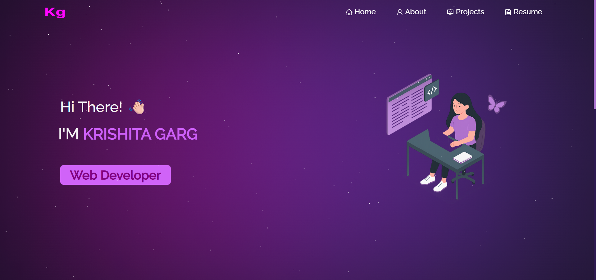

# 🌐 Personal Portfolio

This is my personal **portfolio website** built with **React.js**.  
It reflects my work and passion, featuring projects, skills, and insights — all in one place.

---

## 🚀 Features
- ✨ **Modern UI** with fully responsive design  
- 📂 **Projects Section** – showcases my recent work with live demos & GitHub links  
- 📄 **Resume Section** – always updated with my latest resume  
- 👩‍💻 **About Section** – short introduction, skills, and coding journey  
- 📬 **Contact Section** – quick and easy ways to connect  

---

## 🛠️ Tech Stack
- **Frontend:** React.js, CSS3  
- **Hosting:** Vercel  
- **Version Control:** Git & GitHub  
- **Development Environment:** VS Code  

---

## 📸 Preview

---

### 💡 Note
This portfolio is continuously evolving as I learn, explore, and build new projects. Stay tuned for updates!  

---

Built with ❤️ by **Krishita Garg**
